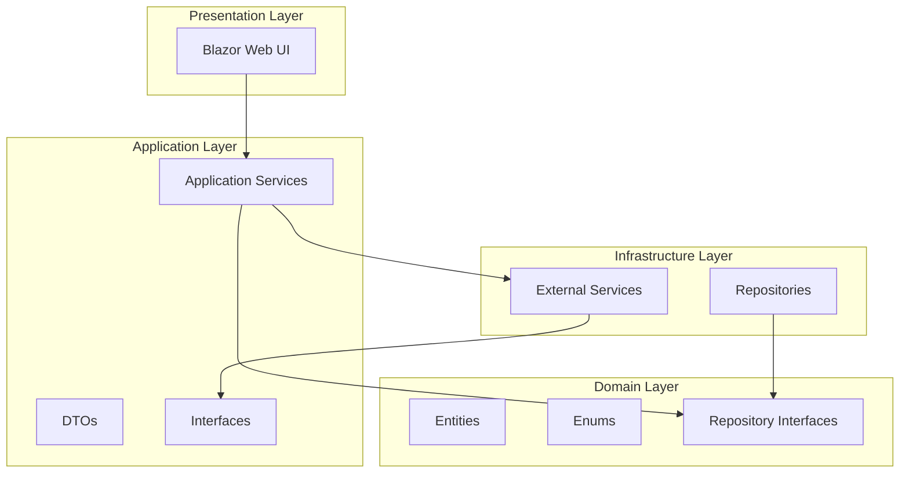

_This is a user-provided file._
# ExpForge Blazor Demo

Este projeto demonstra a integração do **ExpForge CLI** com uma aplicação **Blazor Server** seguindo os princípios da **Clean Architecture**. A aplicação permite gerenciar widgets e templates de forma visual e interativa, mostrando como o ExpForge pode ser usado para automatizar a criação e o versionamento de componentes.

## 🚀 Visão Geral

A solução está estruturada em quatro projetos principais, refletindo a separação de responsabilidades da Clean Architecture:

- **ExpForge.BlazorDemo.Domain**: Contém as entidades principais (`Widget`, `Template`), enums e interfaces de repositório. É o núcleo da aplicação, sem dependências externas.

- **ExpForge.BlazorDemo.Application**: Orquestra a lógica de negócio. Contém os serviços da aplicação (`WidgetService`), DTOs e interfaces de serviços externos (`IExpForgeService`).

- **ExpForge.BlazorDemo.Infrastructure**: Implementa os detalhes técnicos, como acesso a dados (repositórios em memória) e integração com serviços externos (o `ExpForgeService` que interage com o CLI).

- **ExpForge.BlazorDemo.Web**: A camada de apresentação, construída com Blazor Server. Contém os componentes Razor, páginas e a configuração da injeção de dependência.

## ✨ Funcionalidades

- **Dashboard Principal**: Exibe estatísticas sobre widgets e templates, além da versão atual do ExpForge CLI.
- **Gerenciamento de Widgets**: Interface para criar, visualizar, editar e excluir widgets.
- **Visualização de Templates**: Permite explorar os templates disponíveis, ver seus códigos-fonte e parâmetros.
- **Integração com ExpForge**: O `ExpForgeService` na camada de infraestrutura demonstra como invocar o CLI para tarefas como geração de código (simulado nesta demo).

## 🛠️ Como Executar

1.  **Instale o .NET 8 SDK**.
2.  **Instale o ExpForge CLI globalmente** (se ainda não o fez):
    ```bash
    npm install -g expforge
    ```
3.  **Navegue até o diretório do projeto**:
    ```bash
    cd demo/ExpForge.BlazorDemo
    ```
4.  **Execute a aplicação**:
    ```bash
    dotnet run --project ExpForge.BlazorDemo.Web
    ```
5.  Abra o navegador e acesse `https://localhost:5001` (ou a porta indicada no console).

##  архитектура

A imagem abaixo ilustra a arquitetura da solução:



## 📄 Licença

Este projeto de demonstração é distribuído sob a mesma licença do [ExpForge](https://github.com/celinhodaltro/expforge/blob/main/LICENSE).

